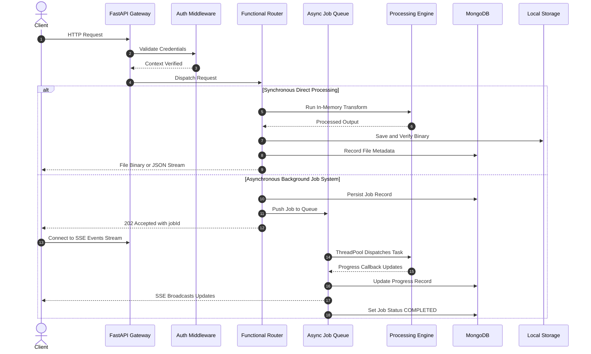
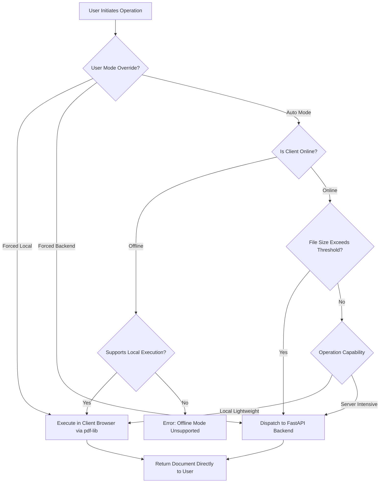
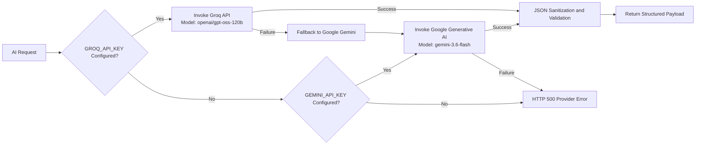
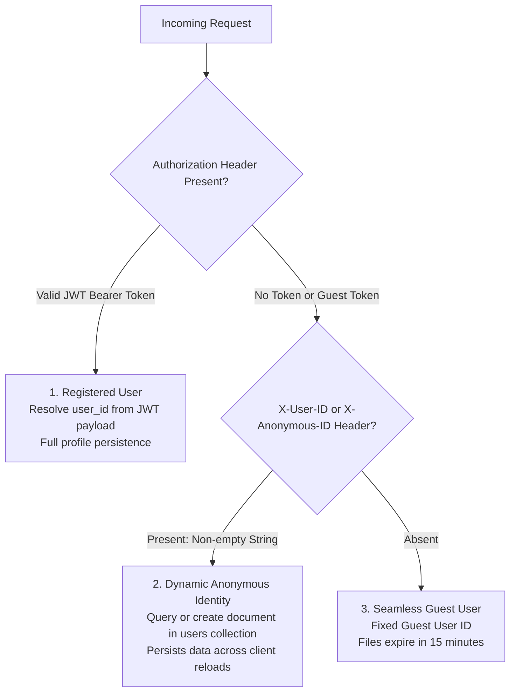

# MASKERV

<div align="center">

**Open-Source Cross-Platform PDF, Document, Media & Academic AI Workspace**

[](https://fastapi.tiangolo.com)
[](https://www.python.org)
[](https://react.dev)
[](https://vitejs.dev)
[](https://capacitorjs.com)
[](https://flutter.dev)
[](https://pymupdf.readthedocs.io)
[](https://opencv.org)
[](https://ffmpeg.org)
[](https://www.mongodb.com)
[](https://docs.pytest.org)

</div>

---

## Table of Contents

1. [Executive Summary](#executive-summary)
2. [Architectural Blueprint & System Topology](#architectural-blueprint--system-topology)
   - [Monorepo Ecosystem Layout](#monorepo-ecosystem-layout)
   - [Data & Execution Control Flow](#data--execution-control-flow)
   - [Hybrid Edge-Cloud Processing Router](#hybrid-edge-cloud-processing-router)
   - [Dual AI Provider Pipeline](#dual-ai-provider-pipeline)
   - [10-Minute Authenticated Temporary Share Architecture](#10-minute-authenticated-temporary-share-architecture)
3. [Technology Stack & Dependency Matrix](#technology-stack--dependency-matrix)
   - [Backend Core (`Services/`)](#backend-core-services)
   - [Web & Mobile Hybrid Client (`maskerv-web/`)](#web--mobile-hybrid-client-maskerv-web)
   - [Cross-Platform Native Client (`maskerv_flutter/`)](#cross-platform-native-client-maskerv_flutter)
4. [Repository Directory Structure](#repository-directory-structure)
5. [Core Feature Catalog & Technical Implementations](#core-feature-catalog--technical-implementations)
   - [1. PDF Processing & Manipulation Engine](#1-pdf-processing--manipulation-engine)
   - [2. In-Place Positional PDF Editor & Text Rectification](#2-in-place-positional-pdf-editor--text-rectification)
   - [3. Document Imposition, Pagination & Legal Tools](#3-document-imposition-pagination--legal-tools)
   - [4. Bi-Directional Document Format Conversion Engine](#4-bi-directional-document-format-conversion-engine)
   - [5. Computer Vision Document Scanner](#5-computer-vision-document-scanner)
   - [6. Cryptography, Security & Ephemeral Sharing](#6-cryptography-security--ephemeral-sharing)
   - [7. Multimedia & Video/Audio Processing Engine](#7-multimedia--videoaudio-processing-engine)
   - [8. Archive Studio Engine](#8-archive-studio-engine)
   - [9. AI Document Intelligence & Academic Research Suite](#9-ai-document-intelligence--academic-research-suite)
   - [10. QR & Barcode Engineering](#10-qr--barcode-engineering)
6. [Client Applications Deep Dive](#client-applications-deep-dive)
   - [React 19 & Capacitor Application (`maskerv-web`)](#react-19--capacitor-application-maskerv-web)
   - [Flutter Cross-Platform Application (`maskerv_flutter`)](#flutter-cross-platform-application-maskerv_flutter)
7. [Comprehensive REST API Reference](#comprehensive-rest-api-reference)
   - [Authentication & Identity Endpoints (`/auth`)](#authentication--identity-endpoints-auth)
   - [Document Storage & File Management (`/files`)](#document-storage--file-management-files)
   - [PDF & Document Processing Tools (`/tools`)](#pdf--document-processing-tools-tools)
   - [In-Place PDF Editor Endpoints (`/editor`)](#in-place-pdf-editor-endpoints-editor)
   - [AI Intelligence & Academic Endpoints (`/ai`)](#ai-intelligence--academic-endpoints-ai)
   - [Asynchronous Job Processing System (`/jobs`)](#asynchronous-job-processing-system-jobs)
   - [Video & Audio Multimedia Operations (`/media`)](#video--audio-multimedia-operations-media)
   - [10-Minute Encrypted Ephemeral Shares (`/temporary-shares`)](#10-minute-encrypted-ephemeral-shares-temporary-shares)
8. [Authentication, Authorization & Multi-Tenant Segregation](#authentication-authorization--multi-tenant-segregation)
9. [Rate Limiting, Quotas & Lifecycle Housekeeping](#rate-limiting-quotas--lifecycle-housekeeping)
10. [Configuration & Environment Variables](#configuration--environment-variables)
11. [Local Development & Quickstart](#local-development--quickstart)
12. [Mobile Build & Compilation Workflows](#mobile-build--compilation-workflows)
13. [Testing, Verification & Quality Assurance](#testing-verification--quality-assurance)
14. [Cloud Deployment & Production Operations](#cloud-deployment--production-operations)
15. [Security & Threat Mitigation Analysis](#security--threat-mitigation-analysis)

---

## Executive Summary

**MASKERV** is a production-grade, open-source, cross-platform document, media, and academic intelligence suite. It addresses the fragmentation, privacy risks, and subscription barriers of contemporary document workflows by combining local, edge-computed WebAssembly utilities, high-performance native mobile compilation, and a robust FastAPI backend service.

The platform provides an end-to-end toolkit covering:
* **Structural PDF Operations**: Zero-dependency merging, splitting, lossless and lossy compression, re-ordering, rotation, watermarking, page duplication, removal, and PDF/A archiving.
* **In-Place PDF Editing**: High-precision PDF text extraction down to glyph coordinates, bounding-box redaction, and replacement overlay matching baseline origins and font styling without flattening documents.
* **Document Imposition & Legal Automation**: N-up layout synthesis, saddle-stitch booklet imposition, dynamic header/footer pagination, legal Bates stamping, AcroForm flattening, and cryptographic file checksum verification.
* **Format Interoperability**: Bi-directional conversions bridging PDF, Microsoft Word (DOCX), Microsoft Excel (XLSX), Microsoft PowerPoint (PPTX), HTML, Text, and Images.
* **Computer Vision Document Scanner**: Real-time quadrilateral contour detection via Canny edge analysis, perspective un-warping, and adaptive threshold filters (Document, Receipt, ID Card with CLAHE LAB optimization, and Book Gamma correction).
* **Cryptographic Security & Ephemeral Sharing**: AES-256-GCM encrypted 10-minute ephemeral file sharing with PBKDF2-HMAC key derivation, zero-plaintext password storage, brute-force throttling, and self-purging storage loops.
* **Multimedia Engineering**: Audio/video conversion, CRF-based video compression, frame-by-frame extraction with direct ZIP streaming, timeline trimming, scaling, audio stripping, and speed/pitch alteration driven by FFmpeg and ffprobe.
* **Archive Studio**: Dynamic creation and password-protected extraction of ZIP, 7Z, TAR, GZ, BZ2, and RAR archives.
* **Document AI & Academic Research Suite**: Dual-provider intelligence leveraging Groq (high-speed LLaMA 3.2 vision & GPT-OSS models) and Google Gemini (Gemini 3.6 Flash fallback) to perform multimodal OCR, semantic differential analysis, N-document similarity matrix generation, RAG-driven document querying, schema-constrained parsing (Invoices, CVs), and an 11-feature academic suite (Literature Review, Research Gaps, Citation Extraction/Formatting, Reference Checking, Study Notes, Quizzes, Flashcards, Mind Maps, Presentations, and Podcast Scripts).

The project is structured as a unified monorepo comprising a Python FastAPI server (`Services/`), a React 19 + Capacitor 8 web and hybrid application (`maskerv-web/`), and a 24-feature Flutter mobile application (`maskerv_flutter/`).

---

## Architectural Blueprint & System Topology

### Monorepo Ecosystem Layout

The repository is organized into three decoupled, complementary tiers:

```
                                    MASKERV Monorepo
                                           │
             ┌─────────────────────────────┼─────────────────────────────┐
             ▼                             ▼                             ▼
        [Services/]                 [maskerv-web/]              [maskerv_flutter/]
      FastAPI Backend              React 19 + Vite              Flutter 3.13+ SDK
    Motor, PyMuPDF, OpenCV       Capacitor 8 Mobile          Syncfusion, Dio, Provider
   FFmpeg, Groq, Gemini AI      Edge-Cloud Hybrid Web         Native Android/iOS/Desktop
```

### Data & Execution Control Flow

The architecture operates on an asynchronous, event-driven pattern designed to preserve responsiveness under heavy CPU load:



### Hybrid Edge-Cloud Processing Router

In the Web and Capacitor client (`maskerv-web/src/services/processingRouter.js`), MASKERV implements an automatic edge-cloud routing matrix. Lightweight manipulations are executed directly in the client browser using `pdf-lib` and WebAssembly, saving server compute and providing offline resilience:



### Dual AI Provider Pipeline

Artificial intelligence operations in `Services/services/ai_service.py` employ a fault-tolerant, tiered hierarchy where API keys are strictly retained on the backend and never dispatched to the client:



### 10-Minute Authenticated Temporary Share Architecture

MASKERV includes an end-to-end encrypted, self-destructing file sharing system (`Services/routers/temporary_shares.py` and `Services/services/crypto_service.py`):

```mermaid
flowchart TD
    subgraph UploadFlow["Upload and Encryption Flow"]
        A["Uploader Provides File and Passphrase"] --> B["Generate 16-byte Salt and 12-byte Nonce"]
        B --> C["Derive 256-bit Key via PBKDF2-HMAC-SHA256"]
        C --> D["Compute HMAC-SHA256 Token Tag and Hash via Bcrypt"]
        C --> E["AES-256-GCM Encrypt File Bytes with AAD Binding"]
        E --> F["Persist Encrypted File to Storage"]
        F --> G["Generate 10-Minute Ephemeral Link"]
    end

    subgraph AccessFlow["Access and Decryption Flow"]
        H["Recipient Opens Share Link"] --> I{"Is Share Active?"}
        I -->|Expired or Max Attempts| J["Deny Access: HTTP 410 or 403"]
        I -->|Active| K["Recipient Submits Passphrase"]
        K --> L["Derive Candidate Key with Salt"]
        L --> M["Verify Tag Against Stored Bcrypt Hash"]
        M -->|Mismatch| N["Increment Counter: Lock if Exceeded"]
        M -->|Match| O["AES-256-GCM Decrypt using Derived Key"]
        O --> P["Stream Decrypted Original File"]
    end

    subgraph Housekeeping["Autonomous Housekeeping"]
        Q["Auto-Purge Loop: Runs Every 120s"] --> R["Query Shares Expired by Timestamp"]
        R --> S["Delete Encrypted Files from Disk"]
        S --> T["Update Database Status to Expired"]
    end
```



---

## Technology Stack & Dependency Matrix

### Backend Core (`Services/`)

| Technology / Library | Version | Functional Purpose in Codebase |
| :--- | :--- | :--- |
| **Python** | `3.11.9` / `3.14+` | Runtime environment for backend services |
| **FastAPI** | `0.115.0` | Asynchronous REST API routing, OpenAPI generation, middleware pipeline |
| **Uvicorn** | `0.30.6` | ASGI production web server |
| **Motor / PyMongo** | `3.5.1` / `4.8.0` | Asynchronous MongoDB driver; paired with custom file-backed mock DB fallback |
| **Pydantic / Settings**| `2.13.4` / `2.4.0`| Request/response schema validation and `.env` parsing |
| **PyMuPDF (`fitz`)** | `1.24.11` | Core PDF rendering, parsing, text extraction, font resolution, editing, redaction |
| **OpenCV (`headless`)**| `4.8.0+` | Computer vision document contour detection, perspective warping, image enhancement |
| **ReportLab** | `5.0.1` | Programmatic PDF layout generation, typography, and Word-to-PDF compilation |
| **python-docx** | `1.2.0` | Native Microsoft Word document manipulation and generation |
| **pdf2docx** | `0.5.13` | Deep layout reconstruction from PDF elements to formatted DOCX documents |
| **openpyxl** | `3.1.5` | Excel workbook generation from PDF tabular extractions |
| **python-pptx** | `1.0.2` | PowerPoint presentation creation from PDF pages and slide-generation AI tools |
| **Pillow (`PIL`)** | `12.3.0` | Image format conversion, thumbnail generation, and metadata handling |
| **FFmpeg / ffprobe** | `5.0+` / `imageio` | Video transcoding, CRF compression, frame extraction, audio speed/pitch altering |
| **cryptography** | `50.0.0` | AES-256-GCM authenticated encryption, PBKDF2-HMAC-SHA256 key derivation |
| **python-jose** | `3.3.0` | HS256 JWT access token encoding, signing, and verification |
| **bcrypt / passlib** | `5.0.0` / `1.7.4` | Password hashing, verification tag comparisons |
| **Groq SDK** | `1.6.0` | High-speed LLM inference client (`openai/gpt-oss-120b`, `llama-3.2-11b-vision-preview`) |
| **Google Generative AI**| `0.8.3` | Gemini API client (`gemini-3.6-flash`) |
| **py7zr / rarfile** | `1.1.3` / `4.5` | Archive creation and password-protected extraction |
| **Pytest** | `9.1.1` | Automated test suite execution (`pytest-asyncio`) |

### Web & Mobile Hybrid Client (`maskerv-web/`)

| Technology / Library | Version | Functional Purpose in Codebase |
| :--- | :--- | :--- |
| **React** | `19.2.8` | Component architecture, state management, and UI rendering |
| **React Router DOM** | `7.18.2` | Client-side routing, code-splitting (`React.lazy`), and navigation guards |
| **Vite** | `8.2.0` | Build tooling, hot module replacement, and asset bundling |
| **Capacitor Core & CLI**| `8.5.0` | Native Android bridge, plugin integration, and mobile compilation |
| **Capacitor Plugins** | `8.0+` | Camera, Filesystem, FileOpener, Share, Haptics, Toast, Clipboard, Device, Network |
| **Framer Motion** | `13.1.1` | Layout animations, page transitions, and interactive UI micro-interactions |
| **pdf-lib** | `1.17.1` | In-browser WebAssembly-like client-side PDF merging, splitting, and watermarking |
| **pdfjs-dist** | `6.2.108` | Canvas rendering for interactive PDF previews and thumbnails |
| **docx-preview** | `0.4.0` | In-browser client-side rendering of DOCX documents inside modals |
| **@ffmpeg/ffmpeg** | `0.12.15` | WebAssembly in-browser media processing fallback |
| **Lucide React** | `1.33.0` | Curated UI icon library |
| **Axios** | `1.19.0` | HTTP client with automatic auth headers, token injection, and error interceptors |
| **Playwright** | `1.62.1` | Automated end-to-end browser testing |

### Cross-Platform Native Client (`maskerv_flutter/`)

| Technology / Library | Version | Functional Purpose in Codebase |
| :--- | :--- | :--- |
| **Flutter SDK** | `3.13.1+` | Cross-platform compilation targeting Android, iOS, Windows, macOS, Linux, Web |
| **GoRouter** | `14.8.1` | Declarative deep-link routing with animated transition wrappers |
| **Provider** | `6.1.2` | Reactive state management for theme, auth, storage, and tool states |
| **Syncfusion Flutter PDF**| `28.2.9` | Client-side mobile PDF engine: merge, split, bates stamping, form filling |
| **Dio** | `5.8.0+` | Networking with multipart uploads, timeouts, and `X-User-ID` interceptors |
| **Mobile Scanner / ZXing**| `7.4.1` / `1.1.4`| Hardware camera QR code and barcode scanning and parsing |
| **Local Auth** | `3.0.2` | Biometric authentication (Fingerprint / FaceID) app lock |
| **Flutter TTS** | `4.2.0` | Text-to-speech audio synthesis for podcast listening and accessibility modes |
| **Lucide Icons Flutter**| `3.0.0` | Cross-platform matching UI icons |
| **Google Fonts** | `6.2.1` | Typography bundling without system font dependency |

---

## Repository Directory Structure

```text
MASKERV/
├── .gitignore
├── .python-version               # Python version specification (3.11.9)
├── cs                            # Approved implementation specifications and architecture decisions
├── render.yaml                   # Declarative Infrastructure-as-Code for Render Cloud Deployment
├── run_local.bat                 # Dual-server local launch script (FastAPI on 8000 + Vite on 5173)
│
├── Deliverables/
│   ├── app release.txt           # Android Gradle build log & Capacitor sync verification
│   └── Python packages           # Manifest of installed backend Python packages
│
├── Services/                     # FastAPI Backend Application Tier
│   ├── config.py                 # Pydantic BaseSettings (.env loader, JWT, AI, engine configs)
│   ├── database.py               # Motor AsyncIOMotorClient + local JSON MockDatabase fallback
│   ├── main.py                   # App entrypoint, lifespan startup/shutdown, CORS, routes mount
│   ├── pytest.ini                # Pytest async test runner configuration
│   ├── render-build.sh           # Cloud build script (Node.js LTS, Python deps, static FFmpeg)
│   ├── requirements.txt          # Python dependencies declaration
│   │
│   ├── middleware/               # HTTP & Security Middlewares
│   │   ├── auth.py               # JWT token verification, dynamic anonymous user resolution
│   │   ├── editor_rate_limiter.py# SQLite-backed daily edit limiter (3 edits/day per client)
│   │   └── rate_limit.py         # MongoDB-backed hourly AI feature rate limiter (5 req/hour)
│   │
│   ├── models/                   # Pydantic Schema Definitions
│   │   ├── file.py               # FileInDB and FileOut schemas
│   │   └── user.py               # UserBase, UserCreate, UserInDB, UserOut schemas
│   │
│   ├── routers/                  # API Endpoint Controllers
│   │   ├── ai.py                 # 31 AI and Academic research endpoints
│   │   ├── auth.py               # Register, login, profile, session clearing, account deletion
│   │   ├── editor.py             # PDF page image rendering, text span extraction, in-place edit
│   │   ├── files.py              # File upload, list, download, metadata, storage usage stats
│   │   ├── jobs.py               # Asynchronous processing jobs and Server-Sent Events (SSE)
│   │   ├── media.py              # Video probe, frame extraction, video editing, compression
│   │   ├── temporary_shares.py   # 10-minute encrypted temporary shares & HTML download portal
│   │   └── tools.py              # PDF merge, split, compress, convert, rotate, watermark, bates
│   │
│   ├── services/                 # Business Logic & Low-Level Processing Engines
│   │   ├── ai_service.py         # Groq & Gemini client orchestration, OCR, research tools
│   │   ├── crypto_service.py     # AES-256-GCM AEAD encryption, PBKDF2-HMAC, bcrypt verifiers
│   │   ├── job_service.py        # Background asyncio queue, worker loop, ThreadPoolExecutor
│   │   ├── processing.py         # 2,700+ lines of PyMuPDF, ReportLab, Word, Excel, PPT engines
│   │   ├── scanner.py            # OpenCV document detection, corner ordering, perspective warping
│   │   └── storage.py            # Local storage sync/async operations, auto-purge routines
│   │
│   ├── storage/                  # Server disk storage root
│   │   ├── temp_shares/          # AES-256 encrypted .enc ephemeral share files
│   │   └── rate_limits.db        # SQLite tracking database for editor rate limiter
│   │
│   └── tests/                    # Backend Automated Test Suite (75 Pytest tests)
│       ├── conftest.py           # Test fixtures, mock DB setup, authenticated client setup
│       ├── test_ai.py            # AI tool route tests
│       ├── test_auth.py          # Authentication, JWT, and user management tests
│       ├── test_conversions.py   # Multi-format conversion engine tests
│       ├── test_crypto_service.py# Cryptographic roundtrip and tamper detection tests
│       ├── test_editor.py        # PDF editor limits and in-place edit tests
│       ├── test_files.py         # File upload, list, download, and cleanup tests
│       ├── test_health.py        # API root, health, favicon, and OpenAPI docs tests
│       ├── test_jobs.py          # Background job lifecycle tests
│       ├── test_media.py         # Media router status tests
│       ├── test_media_video_features.py # Video probe, frame extraction, and editor pipeline tests
│       ├── test_new_features.py  # N-up, Booklet, Bates stamping, and Checksum tests
│       ├── test_temporary_shares.py # Ephemeral share creation, access, and expiry tests
│       └── test_tools.py         # Core PDF tools tests
│
├── maskerv-web/                  # React 19 + Capacitor Web & Hybrid Frontend
│   ├── capacitor.config.json     # Capacitor mobile app ID (com.maskerv.app), splash & status bar
│   ├── package.json              # Node.js dependencies, build scripts, Capacitor targets
│   ├── vite.config.js            # Vite build configuration
│   ├── android/                  # Generated native Android project (Gradle, Java, Kotlin)
│   │
│   ├── src/
│   │   ├── App.jsx               # Root application component
│   │   ├── index.css             # Design tokens, CSS variables, glassmorphism, responsive styles
│   │   ├── components/           # UI Components (Modals, Previewer, Cards, Particle Background)
│   │   │   └── ui/FilePreviewModal.jsx # 48KB Universal Previewer (PDF, DOCX, Video, Audio)
│   │   ├── router/               # React Router index.jsx (Routing, Splash, Health Check)
│   │   ├── screens/              # 37 Tool Screens, 15 AI Screens, Welcome & Core Hubs
│   │   └── services/             # API clients, processingRouter.js, native.js bridge
│   │
│   └── tests/                    # Playwright End-to-End browser test suite
│
└── maskerv_flutter/              # Flutter Cross-Platform Native Client Application
    ├── pubspec.yaml              # Dart SDK & package dependencies declaration
    │
    └── lib/
        ├── main.dart             # Application initialization, orientation locking, provider wiring
        │
        ├── core/                 # Core Infrastructure
        │   ├── constants/        # API configuration, endpoint constants, model constants
        │   ├── i18n/             # Multi-language dictionary (EN, ES, FR, DE, ZH, JA, HI)
        │   ├── router/           # GoRouter route declarations (70+ routes)
        │   ├── services/         # ApiService (Dio), PdfEngine (Syncfusion), StorageService
        │   └── theme/            # AppColors, AppTheme, domain-specific color palettes
        │
        └── features/             # 24 Functional Modules
            ├── academic/         # Research Analyzer, Literature Review, Citations, Quizzes
            ├── accessibility/    # Accessibility Reader, TTS synthesis, High-Contrast mode
            ├── ai_tools/         # OCR, Summarizer, Ask PDF, Semantic Compare, Table Extractor
            ├── analytics/        # Tabular Data Extractor
            ├── cognitive_retention/ # Spaced repetition and active recall study modules
            ├── diagram_studio/   # Mind Map Diagram Editor
            ├── files/            # Document management, storage dashboard
            ├── forms/            # Form Filler & Form Creator
            ├── history/          # Local & remote processing audit log
            ├── home/             # Dashboard, quick actions, category carousels
            ├── image_media_tools/# Converter, Compressor, Resizer, Video Editor, Archive Studio
            ├── legal_audit/      # Contract clause risk analyzer
            ├── p2p_share/        # AirShare P2P local mesh transfer
            ├── pdf_tools/        # Merge, Split, Compress, Convert, Rotate, Bates, Booklet
            ├── profile/          # User settings, dark mode toggle, cache manager
            ├── publishing/       # Publishing studio
            ├── qr_tools/         # QR Generator, QR Scanner, Barcode Generator
            ├── scanner/          # Camera document capture & perspective transformation
            ├── security_tools/   # Protect, Redact, Sign, Metadata, Biometric Lock, Secure Share
            ├── translation/      # Multi-language document translation hub
            ├── voice_podcast/    # Automated audio podcast generation & playback
            ├── welcome/          # Splash screen, Onboarding flow, Feature tour
            └── workspace/        # Dual-pane side-by-side comparison workspace
```

---

## Core Feature Catalog & Technical Implementations

### 1. PDF Processing & Manipulation Engine

Implemented in `Services/services/processing.py`, with local browser execution in `maskerv-web/src/services/processingRouter.js` and Flutter execution in `maskerv_flutter/lib/core/services/pdf_engine.dart`.

* **Merge PDFs (`merge_pdfs`)**:
  * Merges multiple PDF byte arrays in sequential order.
  * Parameters: `page_size` (`"original"`, `"a4"`, `"letter"`, etc.) and `margin_type` (`"none"`, `"small"`, `"normal"`).
  * Automatically handles varied source orientations by normalizing canvas boundaries.
* **Split PDF (`split_pdf`)**:
  * Modes supported:
    1. `"extract"`: Extracts specific pages or discrete ranges (e.g. `"1-3, 5, 8-10"` parsed via `_parse_page_range`).
    2. `"split_by_range"`: Splits document into discrete multi-page batches.
    3. `"split_all"`: Bursts each page into an individual single-page PDF document.
* **Compress PDF (`compress_pdf`) & Estimation (`estimate_compression`)**:
  * Compresses PDF content streams by removing unreferenced objects, cleaning duplicate font descriptors, deflating raw byte streams, and downsampling embedded raster graphics.
  * Presets: `"extreme"`, `"recommended"` / `"balanced"`, `"low"`.
  * Pre-run estimation inspects font tables, metadata overhead, and image streams to compute projected savings without altering the source file.
* **Rotate PDF (`rotate_pdf`)**:
  * Rotates all pages or a targeted subset by 90, 180, or 270 degrees clockwise.
* **Watermark PDF (`add_watermark`)**:
  * Injects rotated text watermarks (configurable text, opacity `0.0 - 1.0`, font size, and diagonal angles) across pages using PyMuPDF drawing layers.
* **Organize PDF Pages (`organize_pdf_pages`)**:
  * Reorders pages based on an array of descriptors: `[{"page": 3, "rotation": 90}, {"page": 1, "rotation": 0}]`.
  * Supports simultaneous deletion, rotation, and duplication in a single memory pass.

### 2. In-Place Positional PDF Editor & Text Rectification

Implemented in `Services/routers/editor.py` and `Services/services/processing.py`.

Unlike basic editors that flatten PDFs into raster graphics, MASKERV retains the underlying vector nature of documents:

1. **Page Image Rendering (`/editor/render-page`)**:
   Renders the requested page at a specified DPI (default 150 DPI) to a PNG byte stream, used as a pixel-aligned viewport background in client editors.
2. **Text Span Extraction (`/editor/extract-spans`)**:
   PyMuPDF inspects the page dictionary (`page.get_text("dict")`), extracting structured text spans containing:
   * Text string and character count
   * Bounding box `[x0, y0, x1, y1]` and normalized relative rectangle coordinates
   * Font family string (resolved via `resolve_pymupdf_font` into standard PyMuPDF base 14 fonts: `helv`, `hebo`, `heit`, `hebi`, `tiro`, `tibo`, `tiit`, `tibi`, `cour`, `cobo`, `coit`, `cobi`)
   * Font size in points and font style flags (Bold, Italic)
   * 24-bit RGB color array `[r, g, b]`
   * Text baseline origin coordinates `[origin_x, origin_y]`
3. **In-Place Modification (`/editor/edit`)**:
   Applies edits in-place:
   * **Text Modification**: Applies a vector redaction annotation (`page.add_redact_annot`) over the original bounding box, sanitizes the underlying PDF text stream via `page.apply_redactions()`, and inserts new text at the exact baseline origin using matching resolved font metrics and colors.
   * **Image Replacement / Overlay**: Decodes base64 image data and injects it into the exact target bounding box coordinates.

### 3. Document Imposition, Pagination & Legal Tools

Implemented in `Services/services/processing.py` and `Services/routers/tools.py`.

* **N-Up PDF Layout (`generate_nup_pdf`)**:
  * Imposes multiple logical pages onto a single physical sheet (2, 4, 6, 9, or 16 pages per sheet).
  * Automatically calculates grid geometries, scale factors, and border dividing rules.
* **Booklet Imposition (`generate_booklet_pdf`)**:
  * Rearranges page sequences for two-sided saddle-stitch booklet printing. Pads document length to multiples of 4 and maps front/back folios (e.g., Pages 4 & 1 on front, Pages 2 & 3 on back).
* **Header and Footer Stamping (`add_headers_footers_pdf`)**:
  * Injects customizable text across six alignment zones: Top Left, Top Center, Top Right, Bottom Left, Bottom Center, and Bottom Right.
  * Evaluates dynamic tokens in real time: `[page]` (current page number), `[total]` (total document pages), `[date]` (current date).
* **Legal Bates Stamping (`apply_bates_stamping`)**:
  * Appends sequential legal numbering to document sets.
  * Supports custom alphanumeric prefixes (e.g., `"CONF-DOC-"`), configurable zero-padding (e.g., 6 digits: `"000042"`), and adjustable positioning.
* **Form Flattening (`flatten_pdf_forms`)**:
  * Iterates through all interactive AcroForm widgets, text inputs, checkboxes, and radio buttons, baking their visual state permanently into the underlying content stream and stripping active form fields.
* **Integrity Checksums (`verify_pdf_checksum`)**:
  * Computes MD5, SHA-1, and SHA-256 cryptographic hashes, byte lengths, and validates structural `%PDF-` header/trailer integrity.

### 4. Bi-Directional Document Format Conversion Engine

Implemented in `Services/services/processing.py` and `Services/routers/tools.py`.

```
                    ┌────────────────────────┐
                    │      Source File       │
                    └───────────┬────────────┘
                                │
        ┌───────────────────────┼───────────────────────┐
        ▼                       ▼                       ▼
      [PDF]                   [Word]             [Excel / PPT]
        │                       │                       │
 ┌──────┴──────┐         ┌──────┴──────┐         ┌──────┴──────┐
 ▼             ▼         ▼             ▼         ▼             ▼
DOCX (docx)  Images    PDF (reportlab)HTML     PDF (reportlab)Images
XLSX (openpyxl) TXT
PPTX (pptx)   HTML
```

* **PDF to Word (DOCX)**: Reconstructs paragraphs, headings, alignment, text styles, embedded images, and tables into a clean OpenXML document via `pdf2docx` with an in-house AST fallback.
* **PDF to Excel (XLSX)**: Identifies tabular borders and cell coordinate structures via `extract_tables_from_page`, instantiating an OpenXML workbook with native spreadsheet cells via `openpyxl`.
* **PDF to PowerPoint (PPTX)**: Converts document pages into native slide decks via `python-pptx`, embedding high-resolution rendered graphics and extracted text blocks.
* **Word (DOCX) to PDF**: Parses paragraphs, runs, font sizes, colors, and tables from DOCX files, programmatically laying out and rendering an equivalent PDF document via ReportLab.
* **Excel / PowerPoint to PDF**: Extracts workbook sheets and presentation slides into formatted ReportLab flowables.
* **HTML to Word (DOCX)**: Parses HTML DOM structures using BeautifulSoup4, converting headings, lists, tables, bold/italic text, and hyperlinks into native Word elements.

### 5. Computer Vision Document Scanner

Implemented in `Services/services/scanner.py`.

The scanner transforms raw smartphone or camera captures into scanned documents using a multi-phase OpenCV pipeline:

1. **Edge Detection**: Decodes image bytes, converts to grayscale, applies a $5\times5$ Gaussian blur, and runs Canny edge detection ($75, 200$ thresholds).
2. **Contour Extraction**: Identifies closed contours, sorts by area, and executes polygon approximation (`cv2.approxPolyDP`) using $2\%$ of the perimeter. If a 4-point polygon is detected, it is selected as the document boundary; otherwise, it falls back to a default $10\%$ margin.
3. **Perspective Transformation**:
   * Orders coordinates via `order_points`: Top-Left, Top-Right, Bottom-Right, Bottom-Left.
   * Calculates maximum Euclidean distances to determine target width and height.
   * Applies `cv2.getPerspectiveTransform` and `cv2.warpPerspective` to obtain an un-skewed rectangular document.
4. **Mode-Specific Enhancements**:
   * **`document`**: Grayscale conversion followed by adaptive Gaussian thresholding (`blockSize=15, C=10`) for crisp black text on clean white backgrounds.
   * **`receipt`**: Grayscale conversion followed by Otsu's binarization (`THRESH_BINARY + THRESH_OTSU`) for high-contrast thermal ink preservation.
   * **`id-card`**: Constrains output to standard ID card aspect ratio ($1:1.58$), converts to LAB color space, applies CLAHE (Contrast Limited Adaptive Histogram Equalization, `clipLimit=3.0`, `tileGridSize=(8,8)`) on the L-channel, and merges back to BGR.
   * **`book`**: Applies Gamma Correction ($\gamma = 1.5$) using a precomputed 256-element lookup table (LUT) to eliminate shadow artifacts across curved book bindings.

### 6. Cryptography, Security & Ephemeral Sharing

Implemented in `Services/services/crypto_service.py` and `Services/routers/temporary_shares.py`.

* **AES-256-GCM Authenticated Encryption**:
  * High-grade symmetric encryption with 128-bit authentication tags providing confidentiality and integrity.
  * Derived from user passphrases using PBKDF2-HMAC-SHA256 with 100,000 iterations and a unique 16-byte cryptographically secure salt (`secrets.token_bytes(16)`).
  * Unique 12-byte initialization vector (nonce) per encryption operation.
  * `share_id` is passed as Associated Authenticated Data (AAD), binding the ciphertext to its specific share record and preventing ciphertext transplantation attacks.
* **Zero-Plaintext Password Architecture**:
  * Passphrases are never persisted in memory or database storage.
  * Verification uses a bcrypt hash generated from an HMAC-SHA256 token tag derived directly from the encryption key.
* **Brute-Force Attack Mitigation**:
  * Tracks access attempts per share. If failed attempts reach 5 (`MAX_PASSWORD_ATTEMPTS = 5`), the share is permanently locked (`status: "locked"`).
* **Autonomous Expiration & Auto-Purge Loop**:
  * Exactly 10 minutes after creation (`expires_at = now + 10m`), shares expire.
  * A background asyncio loop runs every 120 seconds, querying expired records, deleting `.enc` files from disk, and updating MongoDB records.
* **Digital Signature Stamping (`sign_pdf`)**:
  * Decodes client-side drawn canvas signatures or uploaded transparent PNGs.
  * Injects visual signature stamps onto specified pages at exact coordinates `(x, y, width, height)` using PyMuPDF drawing layers.
* **Smart Redaction (`redact_pdf_text`)**:
  * Searches document text for exact strings, regex patterns, or PII entities.
  * Injects vector redaction annotations and wipes underlying text data from the PDF stream.

### 7. Multimedia & Video/Audio Processing Engine

Implemented in `Services/routers/media.py`.

* **Stream Metadata Probing (`probe_video_metadata`)**:
  * Executes `ffprobe` in JSON output mode to extract truthful stream parameters: duration, video codec, audio codec, resolution `(width, height)`, frame rate, and overall bitrate.
* **Video Frame Extraction (`/media/video-extract-frames`)**:
  * Extracts video frames based on custom intervals or target FPS (up to a ceiling of 300 frames to prevent disk exhaustion).
  * Supports instant download of individual frames or on-the-fly streaming of a structured ZIP archive (`/media/video-frames/{job_id}/zip`).
* **Multi-Track Video Editing (`/media/video-edit`)**:
  * Constructs dynamic FFmpeg filtergraphs:
    * Trimming: `-ss <start>` and `-t <duration>`
    * Cropping: `crop=w:h:x:y`
    * Scaling: `scale=w:h`
    * Rotation: `transpose` filter flags
    * Playback Speed: `setpts=(1/speed)*PTS` and `atempo` audio chaining
    * Visual Adjustments: `eq=contrast:brightness:saturation`
    * Text Watermarking: `drawtext` filter with system font resolution (`DejaVuSans.ttf`, `arial.ttf`)
    * Audio Removal: `-an` flag for complete muting
* **Video & Audio Transcoding and Compression**:
  * Transcodes between MP4, WebM, AVI, MOV, MKV, FLV.
  * Compresses video using Constant Rate Factor (CRF) scaling (presets: High, Medium, Low) with target bitrate caps.
  * Transcodes audio between MP3, WAV, AAC, M4A, OGG, FLAC, OPUS.
  * Modifies audio speed and pitch via `atempo` and `rubberband`.

### 8. Archive Studio Engine

Implemented in `Services/services/processing.py` and `Services/routers/tools.py`.

* **Archive Creation (`create_archive_bytes`)**:
  * Compiles multiple files into compressed archives: ZIP (standard Deflate), 7Z (via `py7zr`), TAR, GZ, BZ2.
  * Supports AES-256 password encryption for ZIP and 7Z archives.
* **Archive Extraction (`extract_archive_bytes`)**:
  * Extracts contents from ZIP, 7Z, TAR, GZ, BZ2, and RAR archives.
  * Supports password-protected archives with memory-safe buffer unpacking.

### 9. AI Document Intelligence & Academic Research Suite

Implemented in `Services/services/ai_service.py` and `Services/routers/ai.py`.

```
                    ┌──────────────────────────────┐
                    │    Document Input (PDF)      │
                    └──────────────┬───────────────┘
                                   │
      ┌────────────────────────────┼────────────────────────────┐
      ▼                            ▼                            ▼
[Core Intelligence]       [Academic Suite]             [Parsing & Analysis]
 • Multimodal OCR          • Research Paper Analyzer    • Invoice Parser
 • Summarizer              • Literature Review Synthesizer • Resume Scanner
 • Semantic Compare        • Research Gap Finder        • Table Extractor
 • Similarity Matrix       • Citation Extractor/Format  • Contract Clause Analyzer
 • Ask PDF (RAG)           • Reference Integrity Check  • PII & Privacy Detector
 • Semantic Search         • Study Notes Generator      • Document Classifier
 • Writing Assistant       • Quiz & Flashcard Creator   • Quality Checker
 • Document Translation    • Mind Map & Slide Decks
                           • Audio Podcast Generator
```

#### Core Document AI
* **Multimodal OCR (`ocr_pdf`, `ocr_image`)**: Transcribes text, mathematical formulas, and tables from scans and images, returning structured Markdown.
* **Document Summarization (`summarize_pdf`)**: Produces structured summaries in Executive, Detailed, or Key Points modes across user-selected languages.
* **Semantic Document Comparison (`compare_documents`)**: Compares two documents, extracting structural differences, textual modifications, and contextual additions.
* **Similarity Matrix (`calculate_similarity_matrix`)**: Computes pairwise cosine-like semantic similarity percentages across $N$ uploaded documents.
* **Ask PDF / Document Q&A (`ask_pdf`)**: RAG-based question answering using document text and page markers, returning answers grounded in the text with page citations.
* **Entity Extraction & Schema Parsing (`extract_information`, `parse_invoice`, `parse_cv`)**: Extracts structured JSON data according to predefined schemas (invoices, receipts, resumes, IDs).
* **Privacy & PII Detection (`detect_privacy_and_pii`)**: Detects sensitive personal data (names, emails, phones, SSNs, credit card numbers, addresses, coordinates) with location offsets.
* **Document Quality Checker (`quality_check_document`)**: Evaluates readability scores, layout consistency, and formatting issues.

#### Academic Research Suite
* **Research Paper Analyzer (`analyze_research_paper`)**: Breaks down research papers into core components: Research Questions, Hypotheses, Methodology, Key Findings, Limitations, and Future Directions.
* **Literature Review Synthesizer (`literature_review`)**: Synthesizes multiple papers, identifying recurring themes, methodological differences, and consensus points.
* **Research Gap Finder (`research_gaps`)**: Identifies unexplored questions, limitations, and methodological blind spots in published papers.
* **Citation Extraction & Formatting (`extract_citations`, `format_citations`)**: Extracts in-text citations and reference lists, reformatting them into APA, MLA, Chicago, IEEE, Harvard, or BibTeX styles.
* **Reference Integrity Checker (`check_references`)**: Cross-references in-text citations against the reference bibliography to flag orphaned citations.
* **Study Notes Generator (`generate_study_notes`)**: Generates structured study guides with conceptual breakdowns, key takeaways, and review questions.
* **Quiz & Flashcard Creators (`generate_quiz`, `generate_flashcards`)**: Produces multiple-choice questions, true/false questions, and interactive Q&A flashcards with explanations.
* **Academic Mind Map & Slide Decks (`generate_mindmap`, `generate_presentation`)**: Generates hierarchical node trees for diagram visualization and multi-slide presentation decks with speaker notes.
* **Audio Podcast Script Generator (`generate_podcast_script`)**: Converts academic papers into an engaging two-host conversational podcast dialogue.
* **Legal Contract Clause Analyzer (`analyze_contract_clauses`)**: Analyzes legal agreements for indemnity, liability caps, termination rights, and non-standard covenants.

### 10. QR & Barcode Engineering

Implemented in `maskerv_flutter/lib/features/qr_tools/` and `maskerv-web/src/screens/tools/`.

* **QR Code Generation**: Encodes URLs, plain text, vCards, Wi-Fi network credentials, and geographic coordinates with customizable error correction levels (L, M, Q, H).
* **QR Code Scanning**: Real-time camera capture and image decoding via `mobile_scanner` and `zxing_lib`.
* **Barcode Generation**: Synthesizes standard 1D barcodes (Code 128, EAN-13, UPC-A) for asset tagging and document indexing.

---

## Client Applications Deep Dive

### React 19 & Capacitor Application (`maskerv-web`)

* **Component Hierarchy & Glassmorphic Design System**:
  Built on modern CSS custom properties (`index.css`), featuring dark mode, glassmorphism (`backdrop-filter: blur(16px)`), dynamic typography, and responsive touch layouts.
* **Universal Document Previewer (`FilePreviewModal.jsx`)**:
  A 48KB universal previewer handling:
  * PDF rendering with page-by-page navigation and zoom
  * Microsoft Word (`.docx`) client-side rendering via `docx-preview`
  * HTML5 audio and video playback with native controls
  * High-resolution image zoom and pan
  * Raw text and Markdown formatting with copy and download actions
* **Backend Health Polling & Splash Sequence (`backendHealth.js`)**:
  Monitors cold-start states on cloud hosts (such as Render free-tier spin-ups). Polls `/health` with exponential backoff while displaying service status to users.
* **Native Android Integration via Capacitor**:
  Integrates 17 native plugins (`@capacitor/camera`, `@capacitor/filesystem`, `@capacitor/share`, `@capacitor/haptics`, etc.) with browser fallbacks.

### Flutter Cross-Platform Application (`maskerv_flutter`)

* **Modular Feature Architecture**:
  Organized into 24 distinct domain modules inside `lib/features/`, decoupling business logic from UI layouts.
* **Routing with GoRouter (`app_router.dart`)**:
  Declarative route definitions with custom page transition animations (`CloudTransitionPage`), parameter parsing, and fallback error handling across 70+ routes.
* **Comprehensive Internationalization (i18n)**:
  `app_dictionary.dart` (84KB) provides localized strings across 7 languages: English (en), Spanish (es), French (fr), German (de), Chinese (zh), Japanese (ja), and Hindi (hi).
* **Biometric Security Integration (`local_auth`)**:
  Protects application access using hardware biometric sensors (FaceID / Fingerprint).
* **AirShare P2P Mesh Share**:
  Local device-to-device file transfer over local networks without intermediate cloud storage.

---

## Comprehensive REST API Reference

The backend mounts all routes at both root `/` and `/api/` prefixes.

### Authentication & Identity Endpoints (`/auth`)

| Method | Endpoint | Description | Auth Required |
| :--- | :--- | :--- | :--- |
| `POST` | `/auth/register` | Register a new user account (name, email, password $\ge 8$ chars) | No |
| `POST` | `/auth/login` | OAuth2 password form login; returns JWT bearer token | No |
| `GET` | `/auth/me` | Fetch active user profile and preferences | Bearer JWT |
| `PUT` | `/auth/me` | Update name, password, or preference settings | Bearer JWT |
| `DELETE`| `/auth/delete-account` | Delete user account and associated files | Bearer JWT |
| `POST` | `/auth/clear-session` | Clear guest/user files, history, and jobs | Optional |

### Document Storage & File Management (`/files`)

| Method | Endpoint | Description | Auth Required |
| :--- | :--- | :--- | :--- |
| `GET` | `/files` | List files with pagination (`skip`, `limit`), search, and sorting | Optional (Guest/User) |
| `POST` | `/files/upload` | Upload document (PDF, Word, Excel, PPT, Image, Text $\le 100$MB) | Optional (Guest/User) |
| `GET` | `/files/{file_id}/download` | Stream binary file with SHA-256 verification headers | Optional (Guest/User) |
| `GET` | `/files/{file_id}/download-url`| Retrieve direct download URL | Optional (Guest/User) |
| `PATCH`| `/files/{file_id}/rename` | Rename stored document file | Optional (Guest/User) |
| `DELETE`| `/files/{file_id}` | Soft-delete file record and delete from disk | Optional (Guest/User) |
| `GET` | `/files/storage-usage` | Retrieve aggregated storage statistics (bytes, MB, counts) | Optional (Guest/User) |
| `GET` | `/files/{file_id}/metadata` | Fetch extended file metadata (page count, size, type) | Optional (Guest/User) |

### PDF & Document Processing Tools (`/tools`)

| Method | Endpoint | Description | Payload Parameters |
| :--- | :--- | :--- | :--- |
| `POST` | `/tools/merge` | Merge multiple PDFs | `files` (array), `page_size`, `margin_type` |
| `POST` | `/tools/split` | Split PDF document | `file`, `mode` (extract/range/all), `pages` |
| `POST` | `/tools/compress` | Compress PDF file | `file`, `quality` (extreme/balanced/low) |
| `POST` | `/tools/compress/estimate` | Estimate compression ratio | `file`, `quality` |
| `POST` | `/tools/convert` | Multi-format converter | `file`, `target_format` (docx, pdf, xlsx, pptx, html, txt) |
| `POST` | `/tools/rotate` | Rotate PDF pages | `file`, `degrees` (90, 180, 270), `pages` |
| `POST` | `/tools/watermark` | Watermark PDF | `file`, `text`, `opacity`, `font_size`, `rotation` |
| `POST` | `/tools/organize` | Reorder/delete pages | `file`, `pages_config` |
| `POST` | `/tools/protect` | Encrypt PDF with password | `file`, `user_password`, `owner_password`, `permissions` |
| `POST` | `/tools/sign` | Place visual signature | `file`, `signatures` (array with coords & base64 png) |
| `POST` | `/tools/metadata` | Update/wipe PDF metadata | `file`, `updates` (dict), `wipe_all` (bool) |
| `POST` | `/tools/redact` | Redact text terms | `file`, `terms` (array of strings) |
| `GET` | `/tools/geometry/{id}`| Extract page dimensions | `file_id` |
| `GET` | `/tools/history` | Retrieve processing history| `limit`, `skip` |
| `GET` | `/tools/registry` | Fetch tool capabilities | None |
| `POST` | `/tools/detect-document`| Detect corners via OpenCV | `file` (image) |
| `POST` | `/tools/process-scan` | Warp & filter scan | `file`, `corners` (array), `mode` (document/receipt/id-card/book) |
| `POST` | `/tools/archive/create`| Create ZIP/7Z archive | `files` (array), `format_type`, `password` |
| `POST` | `/tools/archive/extract`| Extract archive | `file`, `password` |
| `POST` | `/tools/pdf/nup` | Impose N-up layout | `file`, `pages_per_sheet` (2, 4, 6, 9, 16) |
| `POST` | `/tools/pdf/booklet` | Saddle-stitch imposition | `file` |
| `POST` | `/tools/pdf/headers` | Add headers and footers | `file`, `header_left`, `footer_center`, etc. |
| `POST` | `/tools/pdf/bates` | Apply Bates stamping | `file`, `prefix`, `start_number`, `digits` |
| `POST` | `/tools/pdf/flatten` | Flatten AcroForm fields | `file` |
| `POST` | `/tools/image/exif-sanitize`| Strip image EXIF metadata | `file` |
| `POST` | `/tools/checksum/verify`| Compute MD5/SHA hashes | `file` |

### In-Place PDF Editor Endpoints (`/editor`)

| Method | Endpoint | Description | Rate Limit |
| :--- | :--- | :--- | :--- |
| `GET` | `/editor/limits` | Check remaining daily edits for client | Unlimited |
| `POST` | `/editor/render-page` | Render PDF page to PNG at custom DPI | Unlimited |
| `POST` | `/editor/extract-spans`| Extract structured text spans with coordinates | Unlimited |
| `POST` | `/editor/edit` | Apply in-place text & image edits | 3 edits / calendar day |

### AI Intelligence & Academic Endpoints (`/ai`)

All AI endpoints enforce a rate limit of 5 requests per hour.

| Method | Endpoint | Description |
| :--- | :--- | :--- |
| `POST` | `/ai/ocr` | Multimodal OCR on document image/PDF |
| `POST` | `/ai/summarize` | Summarize document text (modes: detailed, executive, key points) |
| `POST` | `/ai/compare` | Semantic comparison of two text inputs |
| `POST` | `/ai/similarity-matrix`| Pairwise similarity matrix for multiple texts |
| `POST` | `/ai/search` | Semantic search over text with relevance scoring |
| `POST` | `/ai/classify` | Document type classification and tagging |
| `POST` | `/ai/extract-info` | Schema-based structured information extraction |
| `POST` | `/ai/writing-assist` | Grammar, spelling, tone, and clarity rewriting |
| `POST` | `/ai/detect-privacy` | PII and privacy risk identification |
| `POST` | `/ai/quality-check` | Formatting, structure, and readability evaluation |
| `POST` | `/ai/ask` | RAG question answering over document pages |
| `POST` | `/ai/translate` | Document translation to target language |
| `POST` | `/ai/extract-tables` | Extract tables into Markdown and JSON structures |
| `POST` | `/ai/pdf-to-markdown` | Convert document pages to clean Markdown |
| `POST` | `/ai/generate-report-pdf`| Synthesize formatted PDF report from findings |
| `POST` | `/ai/searchable-pdf` | Produce searchable PDF from scanned inputs |
| `POST` | `/ai/parse-invoice` | Structured invoice field extraction |
| `POST` | `/ai/parse-cv` | Resume and CV skills/experience parsing |
| `POST` | `/ai/analyze-research` | Academic paper methodology and findings analysis |
| `POST` | `/ai/literature-review` | Cross-paper literature review synthesis |
| `POST` | `/ai/research-gaps` | Research gap and limitation discovery |
| `POST` | `/ai/extract-citations` | Extraction of in-text citations and reference entries |
| `POST` | `/ai/format-citation` | Citation reformatting (APA, MLA, Chicago, IEEE, Harvard, BibTeX) |
| `POST` | `/ai/reference-check` | Citation-to-reference bibliography verification |
| `POST` | `/ai/study-notes` | Comprehensive study guide and concept breakdown generation |
| `POST` | `/ai/generate-quiz` | Quiz question generation (MCQ, True/False, Short Answer) |
| `POST` | `/ai/generate-flashcards`| Flashcard generation with question/answer pairs |
| `POST` | `/ai/generate-mindmap` | Hierarchical mind map node generation |
| `POST` | `/ai/generate-presentation`| Presentation slide deck synthesis with speaker notes |
| `POST` | `/ai/podcast-script` | Two-host conversational podcast script generation |
| `POST` | `/ai/analyze-contract`| Contract clause liability and risk analysis |

### Asynchronous Job Processing System (`/jobs`)

| Method | Endpoint | Description |
| :--- | :--- | :--- |
| `POST` | `/jobs` | Enqueue a heavy operation for asynchronous background processing |
| `GET` | `/jobs` | List background jobs for the authenticated user |
| `GET` | `/jobs/{job_id}` | Poll the current status, progress percentage, and output assets |
| `DELETE`| `/jobs/{job_id}` | Cancel a queued or pending job |
| `GET` | `/jobs/{job_id}/events` | Server-Sent Events (SSE) stream delivering real-time progress |

### Video & Audio Multimedia Operations (`/media`)

| Method | Endpoint | Description |
| :--- | :--- | :--- |
| `POST` | `/media/video-info` | Probe video duration, resolution, fps, bitrate, and codecs via ffprobe |
| `POST` | `/media/video-extract-frames`| Extract frames at target interval/FPS into a managed job directory |
| `GET` | `/media/video-frames/{job_id}/zip`| Download all extracted frames as a streaming ZIP archive |
| `GET` | `/media/video-frames/{job_id}/frame/{idx}`| View a specific extracted image frame |
| `POST` | `/media/video-edit` | Apply trim, crop, scale, rotate, speed, filter, text, mute |
| `POST` | `/media/convert-video` | Transcode video across MP4, WebM, AVI, MOV, MKV, FLV |
| `POST` | `/media/compress-video`| CRF-based video compression with target resolution |
| `POST` | `/media/convert-audio` | Transcode audio across MP3, WAV, AAC, M4A, OGG, FLAC, OPUS |
| `POST` | `/media/audio/speed-pitch`| Alter audio playback tempo and pitch |
| `POST` | `/media/video/strip-audio`| Mute video or extract pure audio track |

### 10-Minute Encrypted Ephemeral Shares (`/temporary-shares`)

| Method | Endpoint | Description |
| :--- | :--- | :--- |
| `POST` | `/temporary-shares` | Upload file and encrypt with AES-256-GCM; returns 10-minute share ID |
| `GET` | `/temporary-shares/{share_id}` | Inspect share status, expiration timestamp, and remaining seconds |
| `POST` | `/temporary-shares/{share_id}/verify` | Verify passphrase against bcrypt verifier without downloading |
| `POST` | `/temporary-shares/{share_id}/download` | Decrypt and stream file binary using provided passphrase |
| `DELETE`| `/temporary-shares/{share_id}` | Immediately revoke and purge share from server disk |
| `GET` | `/share/{share_id}` | Server-rendered HTML download portal with live JS countdown timer |

---

## Authentication, Authorization & Multi-Tenant Segregation

MASKERV supports three distinct identity models in `Services/middleware/auth.py`:



1. **Registered JWT Users**:
   * Password hashing via bcrypt (`bcrypt.hashpw` with salt).
   * JSON Web Tokens (JWT) signed with HS256 algorithm via `python-jose`.
   * Standard expiration configured via `ACCESS_TOKEN_EXPIRE_MINUTES` (default 10,080 minutes / 7 days).
   * Dedicated database persistence across user profile, uploaded files, and processing history.
2. **Dynamic Anonymous Users**:
   * Designed for native mobile and guest web sessions that require state persistence without account registration.
   * Clients supply an identifier in `X-User-ID`, `X-Anonymous-ID`, or query parameter `user_id`.
   * The backend dynamically provisions an anonymous user document in `db.users`, segregating file storage and processing history.
3. **Default Guest Users**:
   * Fallback using `GUEST_USER_ID = ObjectId("000000000000000000000001")`.
   * Enables immediate use of all tools without registration friction.
   * Protected by an aggressive background cleanup process that auto-purges guest assets older than 15 minutes.

---

## Rate Limiting, Quotas & Lifecycle Housekeeping

| Mechanism | Scope / Target | Storage Backend | Threshold / Policy | Implementation File |
| :--- | :--- | :--- | :--- | :--- |
| **PDF In-Place Editor** | IP + Cookie Token (`maskerv_client_id`) | SQLite (`storage/rate_limits.db`) | **3 edits per client per calendar day** (resets at midnight UTC) | `Services/middleware/editor_rate_limiter.py` |
| **AI Feature Rate Limiter** | Authenticated or Anonymous `user_id` | MongoDB (`ai_usage_logs` collection) | **5 AI requests per hour per user** | `Services/middleware/rate_limit.py` |
| **Encrypted Share Brute Force**| Specific `share_id` | MongoDB (`temporary_shares` collection) | **5 failed password attempts maximum**; locks share permanently | `Services/routers/temporary_shares.py` |
| **Guest File Auto-Purge** | Files belonging to `GUEST_USER_ID` or `local_user` | Disk (`Services/storage/`) & MongoDB | **15 minutes lifetime**; checked every 120 seconds | `Services/services/storage.py` |
| **Ephemeral Share Purge**| Shares where `expires_at <= NOW` | Disk (`storage/temp_shares/`) & MongoDB | **10 minutes lifetime**; checked every 120 seconds | `Services/routers/temporary_shares.py` |
| **Video Processing Quota** | All `/media/*` input files | In-memory / OS Process | **180 seconds max duration**, **100 MB max size**, **300 frames max** | `Services/routers/media.py` |

---

## Configuration & Environment Variables

### Backend Configuration (`Services/.env`)

Managed via `Services/config.py` using `pydantic-settings`:

| Variable Name | Default Value | Required in Production | Purpose |
| :--- | :--- | :--- | :--- |
| `MONGODB_URL` | `mock://` | Yes (for persistent DB) | MongoDB connection string. If set to `mock://`, activates local JSON file database |
| `DATABASE_NAME` | `maskerv` | No | Target MongoDB database name |
| `SECRET_KEY` | *(Random 64-char key)* | Yes | Cryptographic key used to sign and verify JWT authentication tokens |
| `ALGORITHM` | `HS256` | No | JWT signing algorithm |
| `ACCESS_TOKEN_EXPIRE_MINUTES` | `10080` | No | JWT validity duration (10,080 minutes = 7 days) |
| `GROQ_API_KEY` | `""` | Recommended | API key for high-speed Groq inference |
| `GROQ_TEXT_MODEL` | `openai/gpt-oss-120b` | No | Groq LLM model name |
| `GROQ_VISION_MODEL` | `llama-3.2-11b-vision-preview`| No | Groq Vision model name for multimodal OCR |
| `GEMINI_API_KEY` | `""` | Recommended | Google Gemini API key used for primary or fallback AI generation |
| `FRONTEND_URL` | `https://maskerv-web.onrender.com` | Yes | Permitted CORS frontend origin |
| `BACKEND_URL` | `https://maskerv-backend.onrender.com`| Yes | Public backend host URL |
| `PDF_EDITOR_ENGINE` | `positional` | No | PDF editor positioning mode (`positional`) |
| `PDF_PRESERVE_FONTS`| `True` | No | Preserve original font matching in in-place editor |

### Frontend Web Configuration (`maskerv-web/.env`)

| Variable Name | Default Value | Purpose |
| :--- | :--- | :--- |
| `VITE_API_URL` | `https://maskerv-backend.onrender.com` | Base URL targeting the FastAPI backend service |

### Flutter Client Configuration (`maskerv_flutter/.env` or `api_config.dart`)

| Variable Name / Key | Default Fallback Value | Purpose |
| :--- | :--- | :--- |
| `MASKERV_BACKEND_URL` | `https://maskerv-backend.onrender.com` | Backend REST API endpoint URL |
| `GEMINI_API_KEY` | *(Built-in key)* | Client-side direct Google Generative AI key fallback |
| `GROQ_API_KEY` | *(Built-in key)* | Client-side direct Groq API key fallback |
| `HF_API_KEY` | *(Built-in key)* | Hugging Face inference key |

---

## Local Development & Quickstart

### Prerequisites

* **Python**: 3.11 or newer (virtual environment recommended)
* **Node.js**: 20.x or newer & npm
* **Flutter SDK**: 3.13 or newer (for mobile compilation)
* **FFmpeg**: Installed and accessible in system `PATH` (or placed in `Services/bin/`)

### One-Click Development Launcher (Windows)

Launch both backend and frontend servers simultaneously using the root launcher script:

```cmd
.\run_local.bat
```

This launches:
* **FastAPI Backend**: `uvicorn main:app --reload --port 8000` inside `Services/`
* **Vite Web Server**: `npm run dev` inside `maskerv-web/`

---

### Manual Setup Step-by-Step

#### 1. Backend Service (`Services/`)

```bash
# Navigate to services directory
cd Services

# Create and activate virtual environment
python -m venv .venv
# On Windows:
.venv\Scripts\activate
# On macOS/Linux:
source .venv/bin/activate

# Install dependencies
pip install --upgrade pip setuptools wheel
pip install -r requirements.txt

# Configure environment variables
cp .env.example .env

# Run FastAPI development server
python -m uvicorn main:app --reload --host 0.0.0.0 --port 8000
```

* Swagger API documentation is available at: `http://localhost:8000/docs`
* Redoc interface is available at: `http://localhost:8000/redoc`
* System health check: `http://localhost:8000/health`

#### 2. Web & Capacitor Frontend (`maskerv-web/`)

```bash
# Navigate to frontend directory
cd maskerv-web

# Install dependencies
npm install

# Start Vite development server
npm run dev
```

* Web application is available at: `http://localhost:5173`

#### 3. Flutter Native Client (`maskerv_flutter/`)

```bash
# Navigate to flutter directory
cd maskerv_flutter

# Retrieve Flutter package dependencies
flutter pub get

# Run on connected device, desktop, or emulator
flutter run
```

---

## Mobile Build & Compilation Workflows

### Capacitor Android Compilation (`maskerv-web`)

The React application compiles to a native Android APK or App Bundle (AAB) using Capacitor 8:

```bash
cd maskerv-web

# 1. Build the production React web bundle into dist/
npm run build

# 2. Synchronize web assets and plugins with native Android shell
npm run cap:sync

# 3. Compile Android Debug APK
cd android
.\gradlew.bat assembleDebug

# 4. Or compile Release APK / AAB
.\gradlew.bat assembleRelease
.\gradlew.bat bundleRelease
```

Compiled APK output: `maskerv-web/android/app/build/outputs/apk/debug/app-debug.apk`.

### Flutter Cross-Platform Builds (`maskerv_flutter`)

```bash
cd maskerv_flutter

# Build Android APK
flutter build apk --release

# Build Android App Bundle for Google Play
flutter build appbundle --release

# Build Desktop Applications
flutter build windows --release
flutter build macos --release
flutter build linux --release

# Build Web Single-Page App
flutter build web --release
```

---

## Testing, Verification & Quality Assurance

### Backend Automated Test Suite (Pytest)

The backend includes a 75-test automated suite covering all critical pathways (`Services/tests/`):

```bash
cd Services
.venv\Scripts\activate

# Run all 75 automated tests
pytest -v

# Run a specific test module
pytest tests/test_tools.py -v
pytest tests/test_crypto_service.py -v
pytest tests/test_ai.py -v
pytest tests/test_media_video_features.py -v
```

#### Test Suite Breakdown
* `test_auth.py` (12 tests): Password hashing, JWT token encoding/decoding, registration validation, duplicate email checks, login authentication, profile updates, account deletion.
* `test_tools.py` (10 tests): PDF merging, page organization, splitting, rotation, watermarking, compression, password protection, digital signatures, metadata editing, text redaction.
* `test_conversions.py` (8 tests): Conversions bridging PDF, Word, Excel, PowerPoint, and HTML.
* `test_crypto_service.py` (4 tests): AES-256-GCM encryption roundtrips, incorrect password rejection, bcrypt HMAC verifier checks, ciphertext tampering detection.
* `test_editor.py` (3 tests): SQLite daily edit limiter, text span edits, invalid payload handling.
* `test_files.py` (5 tests): File upload, listing, streaming binary downloads, deletion, guest file cleanup loops.
* `test_media_video_features.py` (4 tests): ffprobe metadata probing, frame extraction (JPG/PNG), direct ZIP streaming, video editor filtergraph pipeline.
* `test_new_features.py` (5 tests): N-up imposing, booklet imposing, headers/footers, Bates stamping, checksum verification.
* `test_temporary_shares.py` (4 tests): Ephemeral share creation, access, expiration, manual revocation, brute-force throttling.
* `test_ai.py` (12 tests): OCR extraction, document summarization, semantic search, document comparison, translation, writing assistant, contract analysis.
* `test_jobs.py` (3 tests): Asynchronous job creation, status polling, cancellation.
* `test_health.py` (4 tests): Root route, health status, favicon, OpenAPI documentation.

### Frontend End-to-End Tests (Playwright)

```bash
cd maskerv-web
npx playwright test
```

### Flutter Test Suite

```bash
cd maskerv_flutter
flutter test
```

Includes 17 test suites covering P2P mesh sharing, QR roundtrips, i18n dictionaries, invoice parsing, cross-domain navigation, and widget layouts.

---

## Cloud Deployment & Production Operations

### Render Infrastructure-as-Code (`render.yaml`)

The repository includes a declarative `render.yaml` blueprint defining production deployment across two synchronized services:

```yaml
services:
  # 1. FastAPI Web Service
  - type: web
    name: maskerv-backend
    env: python
    region: oregon
    plan: free
    rootDir: Services
    buildCommand: chmod +x ./render-build.sh && ./render-build.sh
    startCommand: uvicorn main:app --host 0.0.0.0 --port $PORT
    envVars:
      - key: PYTHON_VERSION
        value: 3.11.9
      - key: DATABASE_NAME
        value: maskerv
      - key: MONGODB_URL
        sync: false
      - key: SECRET_KEY
        generateValue: true
      - key: GEMINI_API_KEY
        sync: false
      - key: GROQ_API_KEY
        sync: false
      - key: GROQ_TEXT_MODEL
        value: openai/gpt-oss-120b
      - key: GROQ_VISION_MODEL
        value: llama-3.2-11b-vision-preview
      - key: FRONTEND_URL
        value: https://maskerv-web.onrender.com

  # 2. React / Vite Static Site
  - type: staticSite
    name: maskerv-web
    rootDir: maskerv-web
    buildCommand: npm install && npm run build
    publishDir: dist
    routes:
      - type: rewrite
        source: /*
        destination: /index.html
    envVars:
      - key: VITE_API_URL
        value: https://maskerv-backend.onrender.com
```

### Render Linux Build Script (`Services/render-build.sh`)

To satisfy system dependencies on headless Linux hosting without root `apt` access, `render-build.sh` automatically:
1. Provisions a local `bin/` directory and prepends it to `$PATH`.
2. Downloads and unpacks standalone **Node.js LTS (v20.18.0)** for helper scripts.
3. Upgrades `pip`, `setuptools`, and installs all `requirements.txt` dependencies.
4. Downloads static Linux release binaries for **FFmpeg** and **ffprobe**, moves them into `bin/`, and assigns execution permissions (`chmod +x`).

---

## Security & Threat Mitigation Analysis

1. **Cryptographic Protection of Ephemeral Data**:
   Temporary shares use authenticated AES-256-GCM encryption. Even with direct access to server disk storage, ciphertext files (`.enc`) cannot be read without the user-selected passphrase. The server stores only a bcrypt hash of an HMAC verification tag, meaning raw passwords never touch memory or database logs.
2. **Associated Authenticated Data (AAD) Binding**:
   Passing the `share_id` as AAD during AES-GCM encryption guarantees that an encrypted file from one share cannot be swapped into another share record.
3. **Strict Path Sanitation & Directory Traversal Prevention**:
   Filename inputs are sanitized using regex (`re.sub(r'[^a-zA-Z0-9._\-+ ]', '_', base)`), preventing path traversal (`../`) and header injection attacks. File storage uses randomly generated UUID prefixes (`{uuid.hex}_{filename}`).
4. **Binary Signature Verification**:
   The storage layer validates actual magic byte signatures rather than relying solely on MIME types. All PDF outputs must satisfy `content.startswith(b"%PDF-")` and successfully load in PyMuPDF before being returned to clients.
5. **CORS & Resource Isolation**:
   `CORSMiddleware` restricts browser origins to production Render domains and local development environments. Cross-Origin Resource Policy headers (`Cross-Origin-Resource-Policy: cross-origin`) prevent unauthorized embedding.
6. **Rate Limiting & Resource Caps**:
   * SQLite-backed daily edit limits prevent API scraping on the PDF editor.
   * MongoDB-backed hourly limits safeguard against AI token exhaustion.
   * Media processing caps inputs at 180 seconds, 100 MB, and 300 extracted frames to prevent memory exhaustion.
7. **Safe Serialization of Binary Errors**:
   A custom FastAPI `RequestValidationError` handler intercepts and sanitizes binary file byte buffers before returning HTTP 422 error responses, preventing server crashes and memory leaks during failed multipart uploads.
